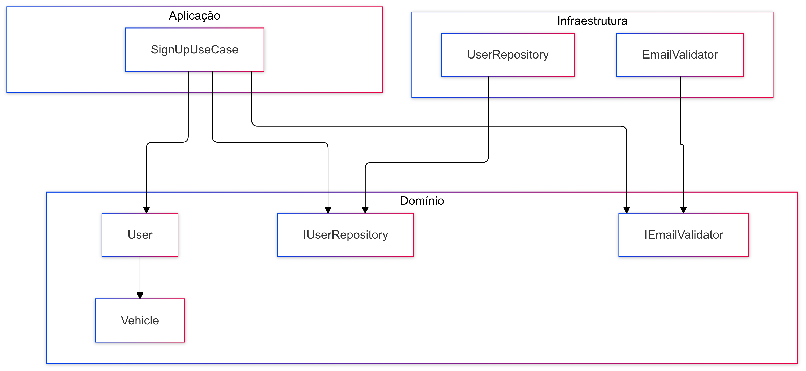

# Projeto Node.js com TypeScript, Jest e Clean Architecture

Este projeto implementa um sistema de cadastro de usuários seguindo os princípios da Clean Architecture, utilizando TypeScript e Jest para testes.


## Autor

- [João Luiz Mineiro Alves](https://github.com/luizmineiro)


## 🛠️ Tecnologias Utilizadas

- Node.js
- TypeScript
- Jest (Testing Framework)
- ESLint (Linting)
- Prettier (Code Formatting)


## 📁 Estrutura do Projeto

```plaintext
src/
  ├── domain/
  │   ├── entities/
  │   │   ├── User.ts
  │   │   └── Vehicle.ts
  │   ├── repositories/
  │   │   └── IUserRepository.ts
  │   └── services/
  │       └── IEmailValidator.ts
  ├── application/
  │   └── usecases/
  │       └── signup/
  │           ├── SignUpUseCase.ts
  │           ├── SignUpDTO.ts
  │           └── SignUpResponse.ts
  └── infrastructure/
      ├── repositories/
      │   └── UserRepository.ts
      └── services/
          └── EmailValidator.ts
test/
  ├── domain/
  │   ├── entities/
  │   │   ├── User.spec.ts
  │   │   └── Vehicle.spec.ts
  │   └── mocks/
  │       └── MockUser.ts
  ├── application/
  │   └── usecases/
  │       └── signup/
  │           ├── SignUpUseCase.spec.ts
  │           └── mocks/
  │               ├── MockUserRepository.ts
  │               └── MockEmailValidator.ts
  └── helpers/
      └── TestFactory.ts
```
## 🚀 Como Executar

### Pré-requisitos
- Node.js (versão 14 ou superior)
- Yarn (ou npm)
###

1. Clone o repositório:
```bash
git clone https://github.com/luizmineiro/tec2-aval
cd tec2-aval
```

2. Instale as dependências:
```bash
yarn install
```
## 📝 Executando os Testes

Testes Unitários

```bash
# Executa todos os testes
yarn test

# Executa testes com watch mode
yarn test:watch

# Executa testes com cobertura
yarn test:coverage
```
### Verificando a Cobertura de Testes
Após executar yarn test:coverage, abra o arquivo coverage/lcov-report/index.html no navegador para ver o relatório detalhado de cobertura.

## 🏗️ Arquitetura

### O projeto segue os princípios da Clean Architecture:

1. Domain Layer:

- Contém as regras de negócio
- Entidades: User, Vehicle
- Interfaces: IUserRepository, IEmailValidator

2. Application Layer:

- Casos de uso da aplicação
- DTOs para entrada e saída de dados
- Implementação das regras de negócio

3. Infrastructure Layer:

- Implementações concretas das interfaces
- Adaptadores para serviços externos
## 📊 Diagrama de Dependência



_Figura 1: Diagrama de dependência do projeto_

O diagrama acima ilustra as relações entre as diferentes camadas e componentes do projeto, demonstrando o fluxo de dependências de acordo com os princípios da Clean Architecture.
## 🧪 Padrões de Teste

### Nomenclatura
- Arquivos de teste: `*.spec.ts` ou `*.test.ts`
- Descrições claras usando `describe` e `it`
- Padrão: `should [expected behavior] when [condition]`

### Exemplo

```typescript
describe('SignUpUseCase', () => {
  it('should create user when valid data is provided', () => {
    // ...
  })
})
```


## 📚 Documentação Adicional


- [jestjs.io](https://jestjs.io/)

- [www.typescriptlang.org](https://www.typescriptlang.org/)

- [blog.cleancoder.com](https://blog.cleancoder.com/uncle-bob/2012/08/13/the-clean-architecture.html)
## 🤝 Contribuindo

1. Faça o fork do projeto
2. Crie uma branch para sua feature (`git checkout -b feature/AmazingFeature`)
3. Commit suas mudanças (`git commit -m 'Add some AmazingFeature'`)
4. Push para a branch (`git push origin feature/AmazingFeature`)
5. Abra um Pull Request


## Licença

Este projeto está sob a licença [MIT](https://choosealicense.com/licenses/mit/)


## 🐛 Encontrou um bug?
Por favor, abra uma issue descrevendo o problema encontrado e como reproduzi-lo.